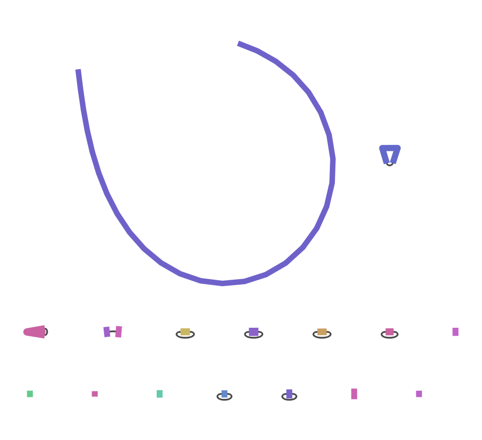

# Ilesta

[](https://doi.org/10.5281/zenodo.18699305)

Ilesta is a de novo genome assembler for long reads. It processes all-vs-all alignments of long-read sequencing data to detect overlaps, construct an overlap graph, and generate assembly unitigs. It does not have a consensus step, so it should be paired with a polishing tool.

## Installation

Ilesta uses [minimap2](https://github.com/lh3/minimap2) for alignment and requires it to be on the PATH.

Option 1: Bioconda (recommended)

```bash
conda create -n Ilesta_env
conda activate Ilesta_env
conda install -c bioconda ilesta minimap2
```

Option 2: Precompiled binaries:

```bash
# Download the binary
mkdir Ilesta; cd Ilesta
wget https://github.com/yvlaere/Ilesta/releases/download/v1.2.0/ilesta-linux-x86_64
chmod +x ilesta-linux-x86_64
mv ilesta-linux-x86_64 Ilesta

# Add Ilesta to your PATH (optional, for easy access):
export PATH="$PWD:$PATH"
```

Option 3: Build from source (requires Rust 1.85.0 or above):

```bash
# Build the release
git clone https://github.com/yvlaere/Ilesta.git
cd Ilesta
cargo build --release

# Add Ilesta to your PATH (optional, for easy access):
export PATH="$PWD/target/release:$PATH"
```

## Usage

A demonstration of the usage of Ilesta using data from: https://doi.org/10.3389/fmicb.2025.1532788

```bash
# Download data, using SRR28262566 as an example
prefetch SRR28262566; cd SRR28262566
fasterq-dump SRR28262566.sra

# Start the assembly
Ilesta assemble --reads-fq SRR28262566.fastq --output-dir out_dir --threads 16
```

This will produce:
- `out_dir/unitigs.fa` (unitigs in FASTA format)
- `out_dir/unitigs.gfa` (assembly graph in GFA format)
- `out_dir/alignments.paf` (all-vs-all read alignments)
- `out_dir/filtered.fq` (reads after filtering)
- `out_dir/graph.dot` (overlap graph visualization)

Ilesta performs an initial round of read filtering (default: --min-read-length 1000 --min-base-quality 10), followed by a second round of filtering where only the longest reads are kept untill a coverage of $\pm$ 50 is reached. Filtering settings can be changed or prefiltered reads can be provided.

```bash
# Long read polishing
minipolish filtered.fq out_dir/unitigs.gfa > polished.gfa

# visualize the assembly graph
Bandage image out_dir/unitigs.gfa out_dir/unitigs.png
```
Ilesta sucesfully assembles the whole bacterial chromosome as one unitig. The smaller unitigs are plasmids. 


```bash
# visualize the overlap graph (not recommended, the graph is usually too large for convenient visualization)
dot -Tpng out_dir/graph.dot -o out_dir/graph.png
```

## Command Line Usage

```
Ilesta --help

Usage: Ilesta <COMMAND>

Commands:
  align                
  alignment-filtering  Alignment filtering
  assemble             Full genome assembly pipeline
  help                 Print this message or the help of the given subcommand(s)

Options:
  -h, --help     Print help
  -V, --version  Print version
```
```
Ilesta assemble --help

Usage: Ilesta assemble [OPTIONS] --reads-fq <READS_FQ>

Options:
  -p, --output-prefix <OUTPUT_PREFIX>
          Output parameters Output prefix [default: unitigs]
  -o, --output-dir <OUTPUT_DIR>
          Output directory [default: .]
  -r, --reads-fq <READS_FQ>
          Read filtering and alignment parameters Input reads in FASTQ format
  -t, --threads <THREADS>
          Number of threads [default: 4]
  -a, --paf <PAF>
          Output PAF file [default: alignments.paf]
      --min-read-length <MIN_READ_LENGTH>
          Minimum read length [default: 1000]
  -q, --min-base-quality <MIN_BASE_QUALITY>
          Minimum average quality [default: 10]
      --genome-size <GENOME_SIZE>
          Optional input genome size (if not provided, will be estimated from data)
  -l, --min-overlap-length <MIN_OVERLAP_LENGTH>
          Alignment filtering parameters (optional if --overlaps is provided) Minimum overlap length [default: 2000]
  -c, --min-overlap-count <MIN_OVERLAP_COUNT>
          Minimum overlap count [default: 3]
  -i, --min-percent-identity <MIN_PERCENT_IDENTITY>
          Minimum percent identity [default: 5]
      --overhang-ratio <OVERHANG_RATIO>
          Overhang ratio [default: 0.8]
      --overlaps <OVERLAPS>
          Pre-computed overlaps binary file (optional, if provided skips alignment filtering)
      --max-bubble-length <MAX_BUBBLE_LENGTH>
          Assembly parameters Maximum bubble length (used during bubble removal) [default: 100]
      --min-support-ratio <MIN_SUPPORT_RATIO>
          Minimum support ratio for bubble removal [default: 1.1]
      --max-tip-len <MAX_TIP_LEN>
          Maximum tip length for tip trimming [default: 4]
      --fuzz <FUZZ>
          Fuzz parameter for transitive edge reduction [default: 10]
      --cleanup-iterations <CLEANUP_ITERATIONS>
          Number of cleanup iterations to run [default: 3]
      --short-edge-ratio <SHORT_EDGE_RATIO>
          Short edge removal ratio (heuristic simplification) [default: 0.8]
  -h, --help
          Print help
```

## Development

Ilesta is under active development.
